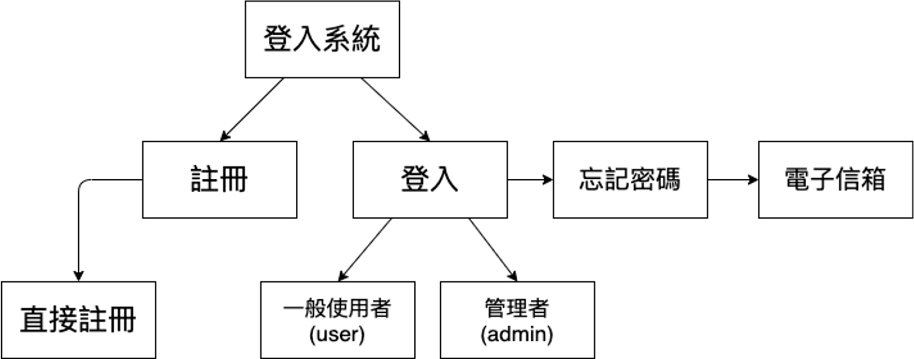
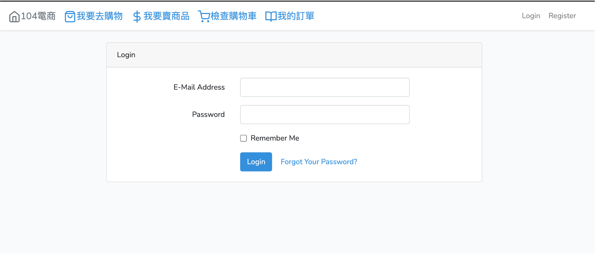
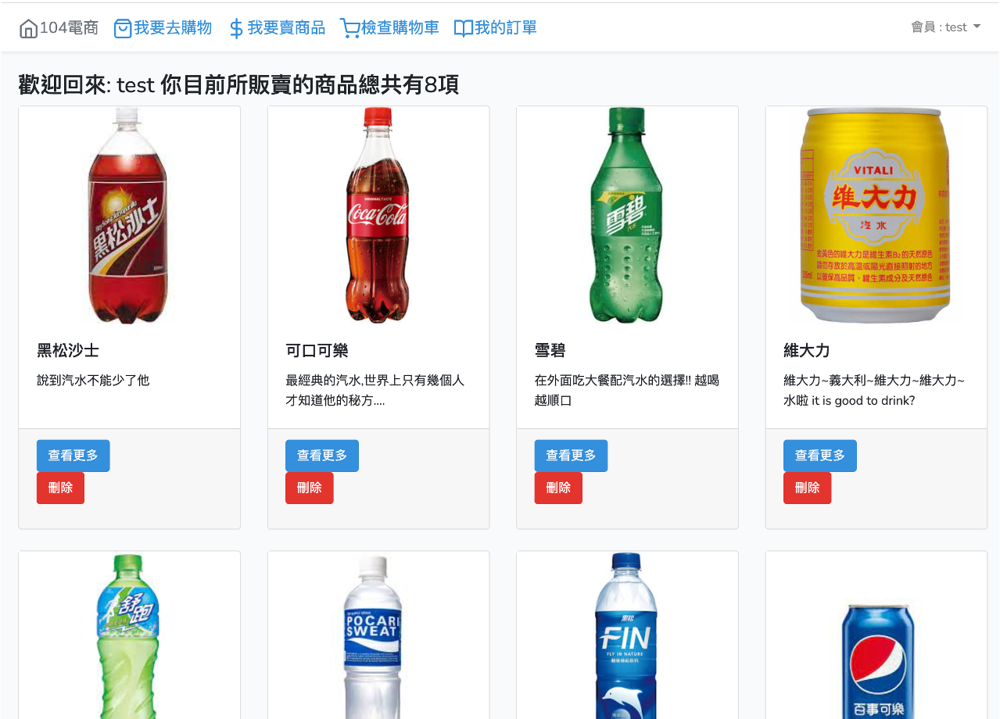
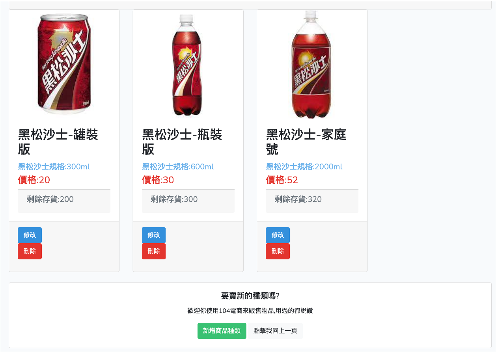
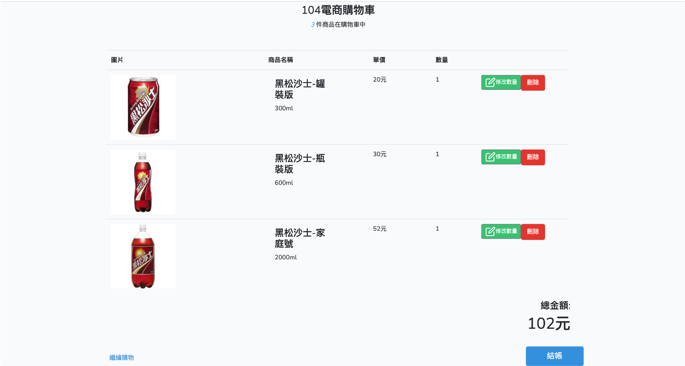
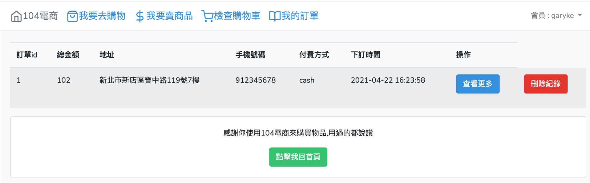
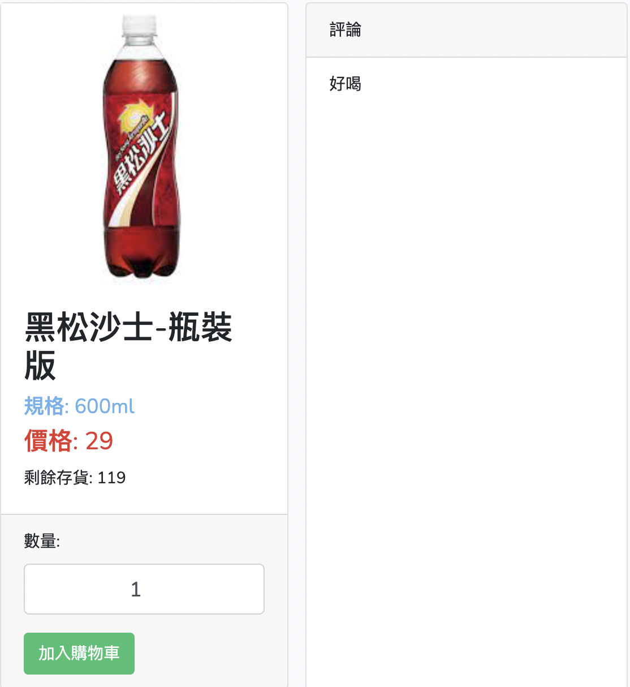
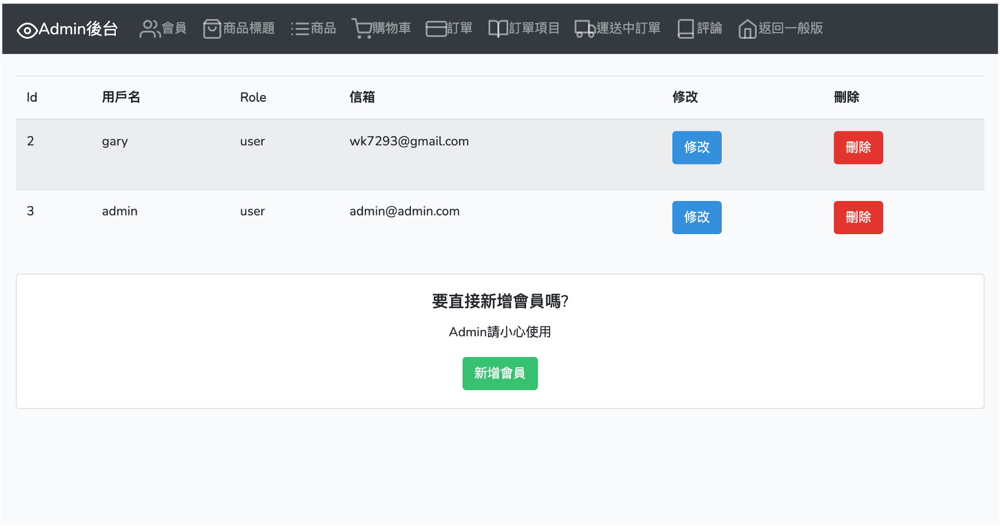
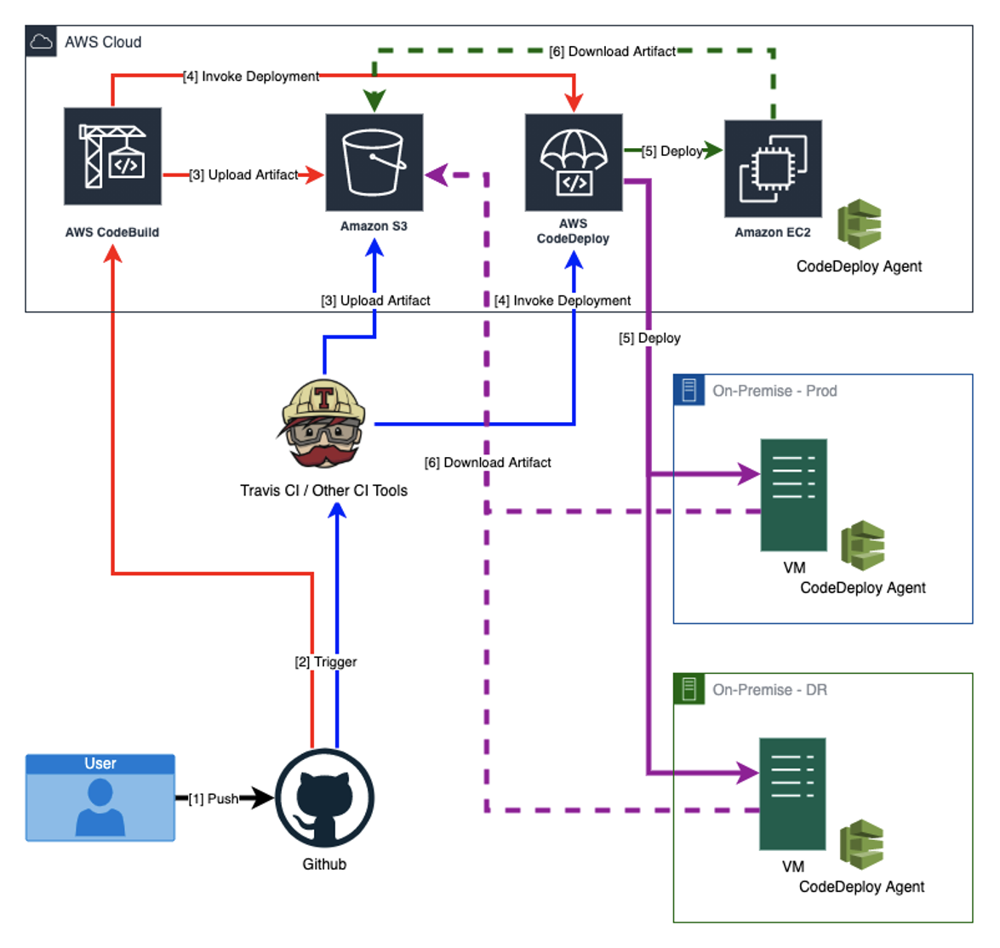

# garyke-Project

## 104電商

    - 登入系統
    - 商品標題
    - 商品物品
    - 購物車
    - 訂單
    - 訂單物品
    - 評論
    - 後台管理系統

## 登入系統

    - 使用laravel給的基本登入系統
    - 註冊,登入,忘記密碼會傳送信件至電子信箱
  

## 商品標題

    - 商品標題可以是一個商品的集合,也可以想像成一個自己的賣場,裡面賣不同的東西
  

## 商品物品

    - 為一個商品的實際單位

## 購物車

    - 一般的購物車功能

## 訂單

    - 為訂單物品的集合

## 訂單物品

    - 一個訂單物品可以有不同的狀態;取消,出貨,運送中,取貨,完成

## 評論

    - 可以為商品物品增加評論

## 後台管理系統

    - 為前台所有功能集合至後台,由admin來處理,並且由admin來模擬物流業者,將訂單的物品狀態從運送中變取貨

## CI/CD

